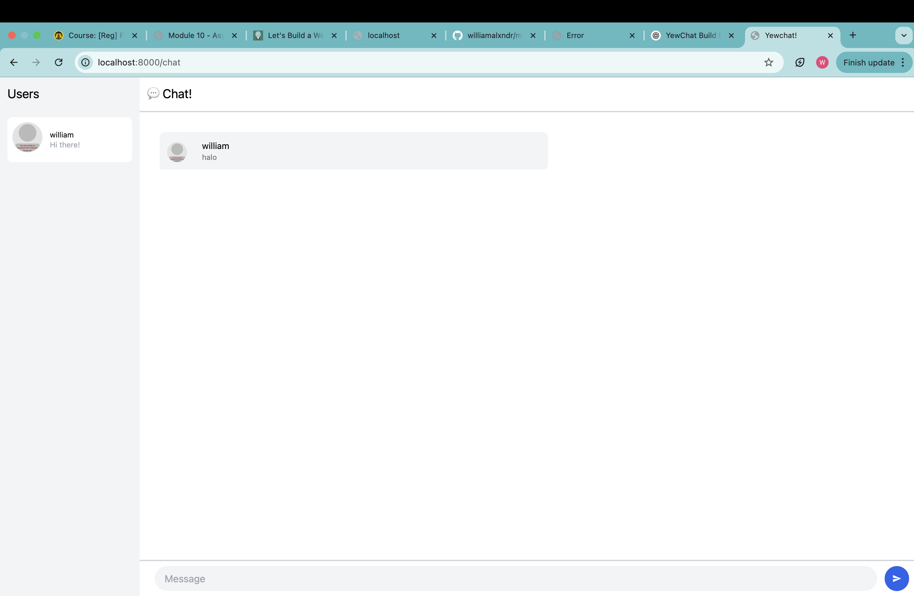
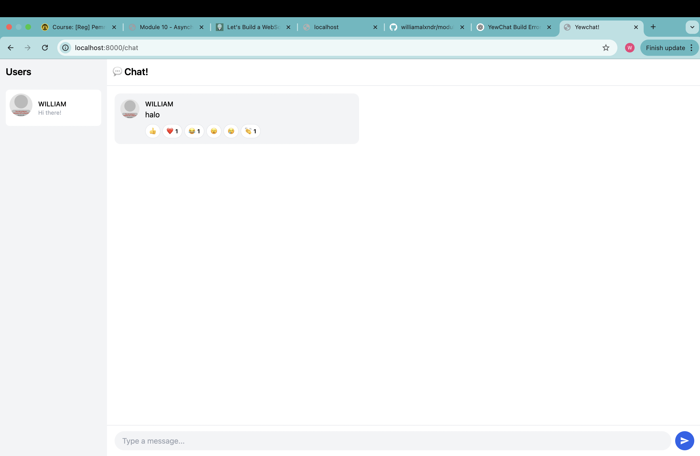

## 1. Original code

Pada saat pertama kali server dijalankan, aplikasi ini meminta nama kita sebagai nama yang akan ditampilkan di layar. Lalu kita dapat mengirimkan pesan pada aplikasi ini.

Saya menambahkan fitur untuk memberikan reaksi pesan dari pengguna. Setiap pengguna hanya dapat memberikan masing masing satu jenis reaksi sebanyak satu kali pada setiap pesan.